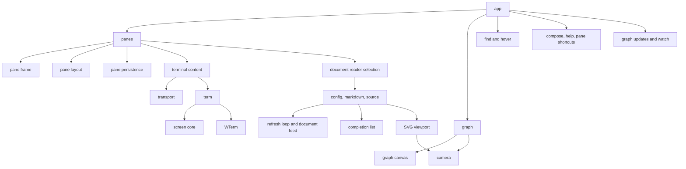

The frontend uses browser ES modules and DOM APIs. `src/web/app.js` is the composition root: it constructs the graph, workspace, search, help and command entry, and starts diagnostics and server watches. Importing a component does not construct a pane or register its interaction handlers.

The folders follow the visible features and their supporting code:

| Folder | Contents |
| --- | --- |
| `panes/` | Workspace, frames, rails, persistence and pane shortcuts |
| `terminal/` | Terminal content, WTerm adapter and screen cache |
| `graph/` | Main graph, canvas tiles, camera, SVG viewport, search and file actions |
| `documents/` | Reader selection, Markdown and source readers, refresh feeds and zoom controls |
| `config/` | Config editor, command completion and node search |
| `ui/` | Main command entry and help |
| `shared/` | Session transport, refresh scheduling, server watches, suggestion lists, text matching and diagnostics |
| `fonts/` | Bundled UI fonts |

`app.js`, `index.html` and `style.css` remain at the root. Modules import their dependencies directly using relative paths. The server serves nested assets from its static roots and rejects hidden segments and directory traversal.

Dependencies point from owners to the pieces they compose:

`panes/workspace.js` owns one map keyed by pane ID and the selected pane. Rails hold ordering; the remote and closing sets track server reconciliation, not additional local pane registries. Startup descriptions and subsequent openings use the same factory and inert HTML template. Initial config and harness IDs remain stable for saved placements. Initial document descriptions include their file, so recovery does not construct a terminal renderer for a document.

`panes/frame.js` owns the header, body, dimensions, collapse state, pointer gestures and geometry observer. It reports interaction and geometry changes through callbacks. It knows nothing about sessions, document formats, persistence or rail membership. Opening and closing the body are explicit state changes; they do not simulate header clicks. All content types use the same grid layout for top and bottom docking.

`panes/layout.js` owns docking, rail order, scrolling, snapping and rail geometry. Explicit changes and frame observers schedule layout with requestAnimationFrame; there is no periodic geometry poll. `panes/persistence.js` serializes geometry supplied by the workspace and layout, including expanded height for collapsed panes. It does not create content or decide which panes exist.

Terminal content owns startup, stream subscription, resize synchronization and renderer lifetime. The workspace detaches content before closing or replacing it, waits for pending startup before remote shutdown, and filters pending closures from server reconciliation. Document readers expose focus and stop. To add a document format, implement a reader and register it in `documents/document.js`; frame, rails, selection, closing and recovery need no format-specific changes. A terminal can still become a document when its running command invokes vz.

Markdown and source readers share `documentFeed`. All readers use `refreshLoop` for scheduling, cancellation and rejection of stale responses. Each editor retains its own unsaved input; the file remains authoritative. Config mutations invalidate pending reloads. Config completion data is passed in by the application instead of obtained by querying another view's DOM.

`completionList` handles suggestion rendering, keyboard navigation, selection and accessibility for both command inputs and both searches. Callers provide matching and acceptance behavior. Main search and command entry preview selections; config inputs accept them explicitly.

The camera owns only coordinates, zoom, fit and projection. Main graph rendering remains tiled canvas; config diagrams remain SVG. Their rendering and interaction details stay separate. `graph/canvas.js` owns compiled geometry and tile caching.

The terminal adapter uses WTerm's public core, measurement, refresh and render callbacks. It neither replaces WTerm methods nor writes renderer or scrolling internals. libvterm remains the only terminal emulator.

Run `node tools/frontend-checks.mjs` for camera invariants, refresh cancellation races and dependency boundaries. The test rejects module cycles and dependencies from the independent frame, layout, camera, completion and refresh primitives into application features. Browser checks are described in `panes.md`; run suites that restart servers sequentially because the temporary servers select the first available port.
